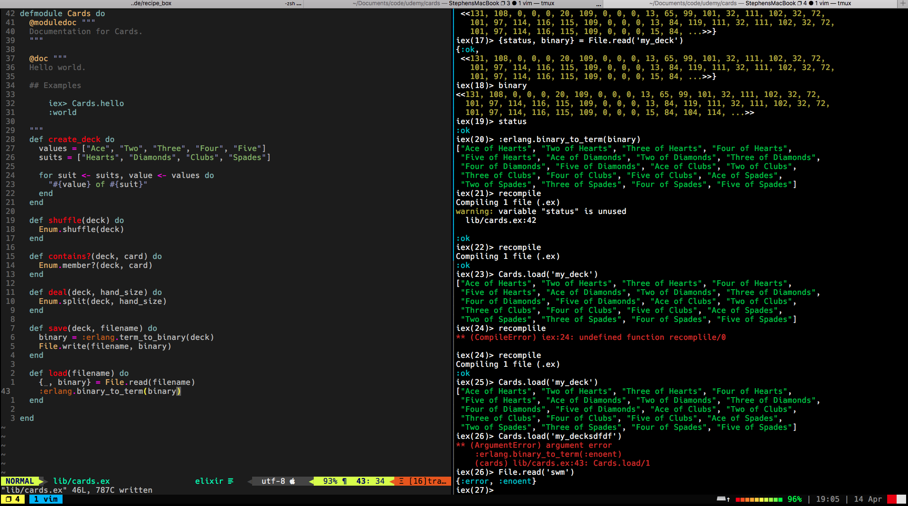

# Cards

## Description

Example app I am following through to gain more knowledge of Elixir.
Currently there are no tests but I am practising a form of TDD by 
using [tmux](https://en.wikipedia.org/wiki/Tmux) and the interactive
elixir shell `iex -S mix`




## Development Info

### Installation

```
git clone https://github.com/swmcc/cards.git
cd cards 
```

#### Running locally

```elixirlang
iex -S mix
```

